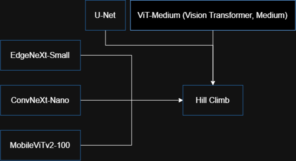

# Moon Surface Crater-Hill Classification

## About Competition

This notebook was made for the competition hosted by IEEE SIES GST: **"The Pareidolia Paradox"**.

## Problem Statement

We have been provided with a dataset of 9,854 images of the Moon surface which contains craters and hills. The train set consists of 7,854 images while the test set consists of 2,000 unlabelled images. The resolution of images is 256 × 256 pixels. The aim of the competition is to classify the images as `0` (craters) or `1` (hills). We have also been provided with metadata for the sun azimuthal angle.

## EDA

- The target column is `label`, which has two categorical values as mentioned earlier: `0` and `1`.
- The dataset has an imbalance: there are 5,000 images of hills but only 2,854 images of craters, meaning 63.66% of images are hills while the remaining 36.34% are craters.
- No missing values or duplicates.

## Methodology

The evaluation metric for the competition is **balanced accuracy**, so it is important that both craters and hills are correctly classified:

$$\text{Balanced Accuracy} = \frac{\text{Sensitivity} + \text{Specificity}}{2} = \frac{1}{2} \left( \frac{\text{TP}}{\text{TP} + \text{FN}} + \frac{\text{TN}}{\text{TN} + \text{FP}} \right)$$

- Our validation method was **5-fold stratified validation**, to get an accurate understanding of model performance.
- **ResNet-18** was chosen as the base model to test features.
- We were given a clue to use the **sun azimuthal angle** in our model. There are two ways it could be implemented:
  1. **Rotation of images counter-clockwise by `-sun_azimuth_angle`.** *(implemented)*
  2. **As a feature.** The sun's azimuthal angle influences the brightness in each image, which becomes a critical factor in crater and hill feature engineering. Crater images tend to have dark patches concentrated in one section, while hill images have brighter patches spread across the image with a pitch-black sky at the top. We tested this as a feature, but it reduced our baseline score by 0.02 to 0.03, so it was dropped.
- Overall, ResNet models (ResNet-18, ResNet-34, and ResNet-50) performed quite poorly:

| Configuration | Balanced Acc |
| --- | --- |
| ResNet-18, AdamW, LR=0.0003, WD=0.0001, LF=weighted cross-entropy, Batch Size=32, Epoch=15 | 0.5408 |
| ResNet-34, AdamW, LR=0.0003, WD=0.0001, LF=weighted cross-entropy, Batch Size=32, Epoch=15 | 0.5629 |
| ResNet-50, AdamW, LR=0.0003, WD=0.0001, LF=weighted cross-entropy, Batch Size=32, Epoch=15 | 0.5329 |

- After testing a couple of different models, a few models stood out and were ensembled using Hill Climb:

  

## Results

| Model | Balanced Accuracy | Weight |
| --- | --- | --- |
| ConvNeXt-Nano | 0.7503 | 0.3137 |
| ViT-Medium | 0.7465 | 0.2941 |
| EdgeNeXt-Small | 0.7492 | 0.2549 |
| U-Net | 0.7479 | 0.1176 |
| MobileViTv2-100 | 0.7438 | 0.0196 |
| **Ensemble (Hill Climb)** | **0.7621** | N/A |

## LinkedIn Post

[View the LinkedIn post here](https://lnkd.in/p/dqev7cW8)

## Proof of Work

[Watch Proof of model run here](https://drive.google.com/file/d/13A1UWUnkRhki2H25UdC1Ebz6guot5wUG/view?usp=sharing)
